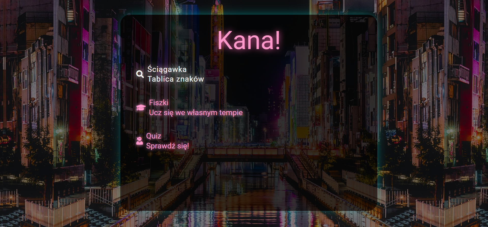

# KanaApp

Simple project to learning japanese characters: hiragana and katakana.

I create this application as a final Coders Lab bootcamp project.
I always was interested in japanese culture, specially manga and anime. I started learning japanese hiragana and katakana but I was bored writing another lines of characters. So I decided to learn more effectively by creating my own app for it.
Application shows 3 elements in menu:

- two tables
- flashes
- quiz

If you want to check this app you need to install JSON server at your IDE.

- install JSON in console in main folder: npm install json-server (you have to install npm node.js and before!);
- open in terminal folder with kana.json and write in console: json-server --watch kana.json;

##Screenshots

